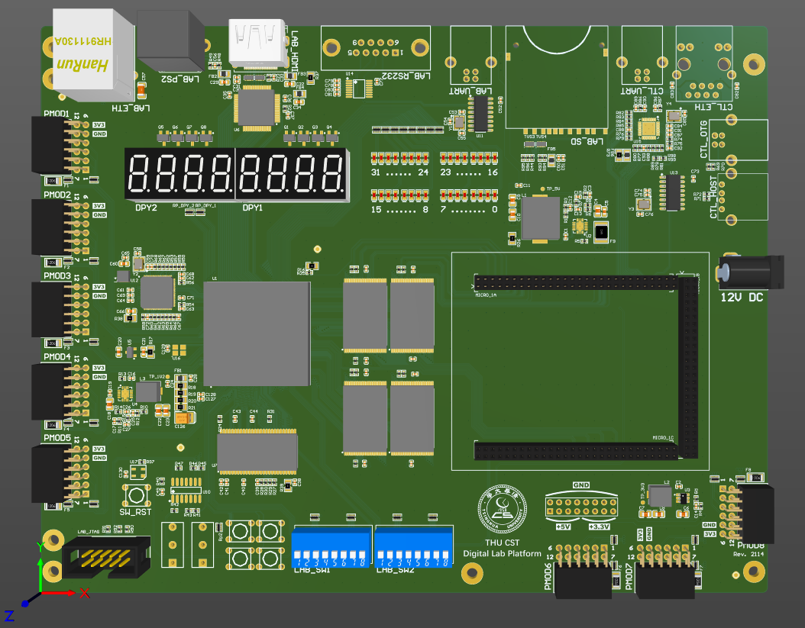
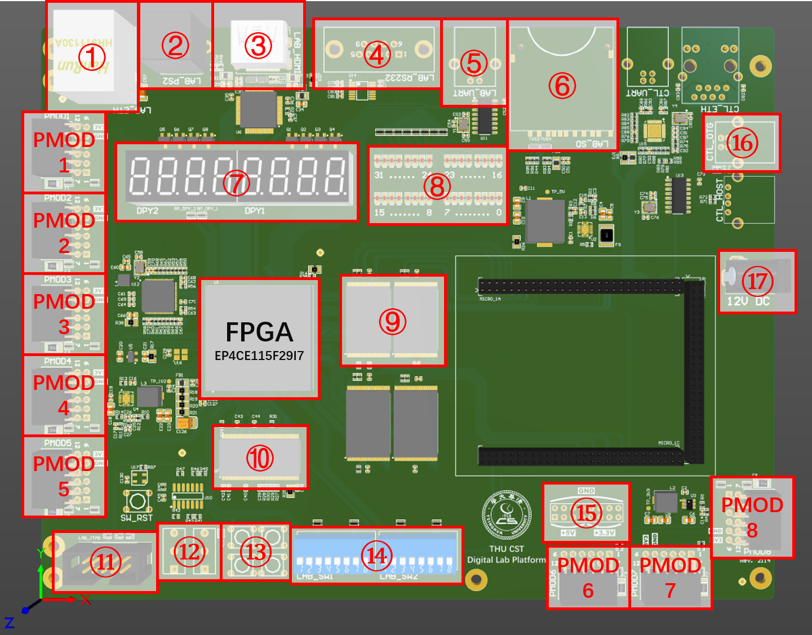

# 实验板说明

## 实验板外观

!!! warning "了解硬件"

    在开始进行你的实验之前，请务必仔细阅读本章，了解实验板各组件的功能，防止错误的硬件连接损坏实验板。

《数字逻辑设计》课程所用的实验板外观如图：

实验时可能用到的组件标号如下图，具体描述及功能请阅读下一节了解。

## 各组件说明

图片中使用红圈标注的组件描述如下：

1. 千兆 RJ45 以太网接口：使用 RTL8211 PHY 芯片，通过 GMII 总线与 FPGA 相连；
2. PS/2 键盘、鼠标接口；
3. HDMI 视频接口：最高支持 1080P 24 位色，使用 VGA 时序，样例代码请参考工程模板；
4. RS-232 串口：可连接使用 RS-232 电平的串口外设；
5. USB 转 TTL 串口：连接电脑可用于 FPGA 的调试输出；
6. SD 卡座：建议使用小容量低速 SD 卡，并通过 SPI 协议访问；
7. 8 位扫描式数码管：使用方法请参考工程模板；
8. 32 位 LED 灯：用于调试，输出高电平时点亮；
9. 4MB SRAM 内存：32 位宽，理论延迟为 10ns；
10. 32MB SDRAM 内存：16 位宽，需要使用专用的控制器模块；
11. FPGA JTAG 调试接口：用于连接 USB Blaster 下载程序；
12. 2 个带去抖按键：自带硬件去抖电路，按下时为高电平；
13. 4 个普通按键：不带去抖电路，按下时为低电平；
14. 16 位拨码开关：拨上时为低电平；
15. 电源输出接口：可用于给外设模块供电，支持 5V 和 3.3V 两种电压；
16. USB 控制接口：连接电脑，可用于读写 SRAM 内存；
17. 电源输入接口：**只允许** 连接提供的 12V 直流电源，用于给实验板供电。

另外，我们还提供了 8 个 Pmod 扩展接口，可连接兼容 Pmod 标准的外设模块，或使用杜邦线连接其他外设模块。具体使用方法参见 [常见外设](peripheral.md) 章节。
